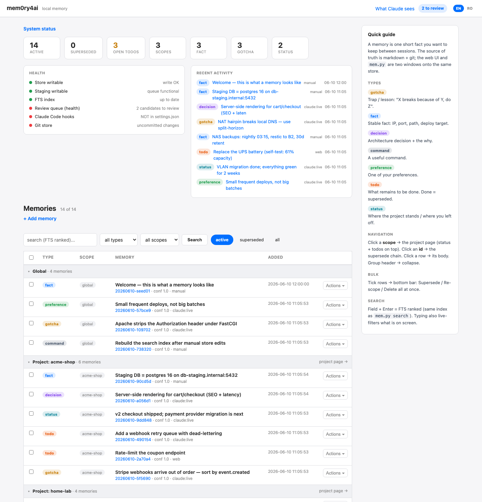
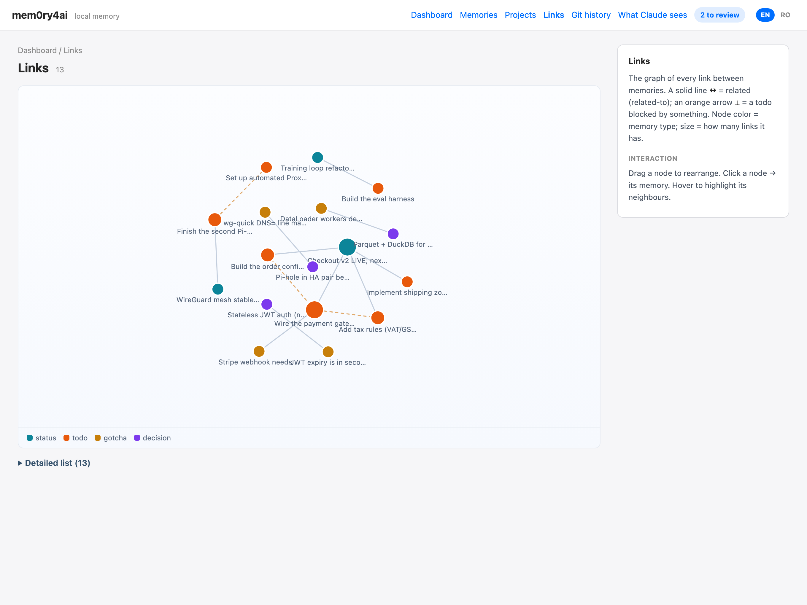
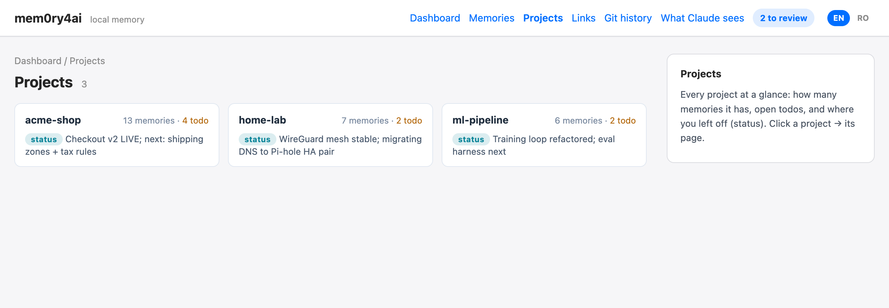
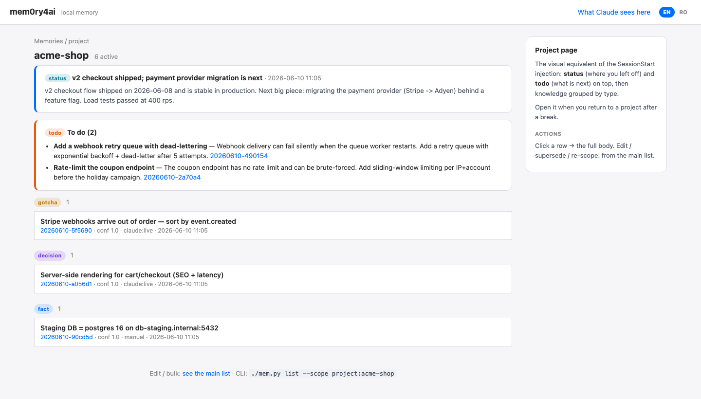
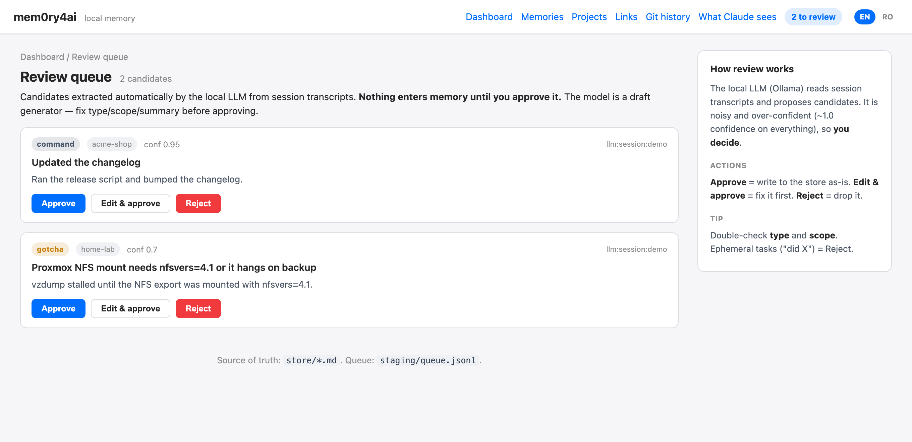
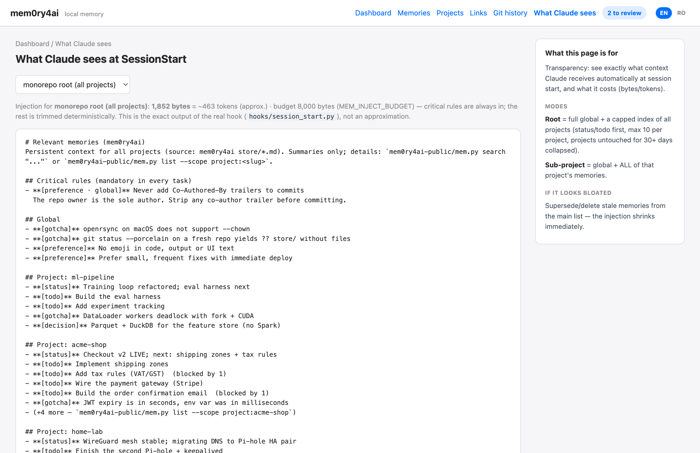
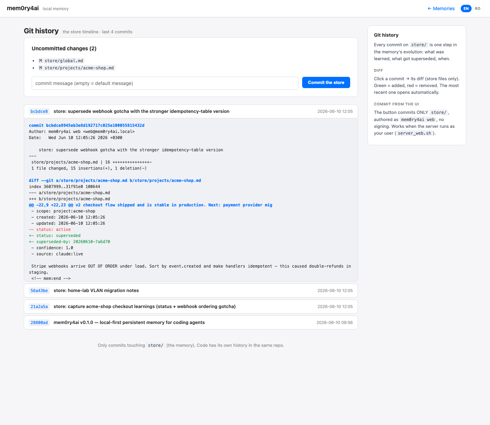

# mem0ry4ai

Persistent, local-first memory for coding agents — built for [Claude Code](https://claude.com/claude-code).

**Landing page:** [cremenescu.ro/en/mem0ry4ai](https://cremenescu.ro/en/mem0ry4ai/)

Your agent forgets everything between sessions. mem0ry4ai fixes that: it captures durable
knowledge (gotchas, decisions, facts, commands, preferences, todos, project status), stores it
in **plain markdown versioned by git**, and **injects the relevant slice automatically** at the
start of every session — scoped to the project you are working in.

## Why another memory tool?

We surveyed the landscape first (claude-mem, basic-memory, mem0, Letta/MemGPT, Graphiti,
agentmemory, the official MCP memory server). Recurring failure modes shaped this design:

| Common failure | mem0ry4ai answer |
|---|---|
| Model forgets to call save/recall tools | **Deterministic hooks** inject at SessionStart; the agent is *instructed* to write proactively |
| Vector DB fragility (Chroma/Qdrant = #1 source of real bug reports) | **Markdown + git is the source of truth**; SQLite FTS5 index is *derived and disposable* |
| Memory rots (stale facts, contradictions) | **Supersede, never delete** — old records keep history; git keeps everything |
| Auto-extraction noise (small LLMs are over-confident: ~1.0 confidence on everything — we measured) | **Trust-gated writes**: the in-context agent writes directly; batch LLM extraction goes through a human review queue |
| Tools that vandalize CLAUDE.md / fight native memory | Coexists cleanly — own namespace, never touches your files |
| Nobody remembers "where was I?" on returning to a project | First-class **`todo`** and **`status`** types, pinned in injection and UI |
| Credentials accumulate in an unencrypted memory file | **Secret redaction on every write path** (8 patterns: API keys, Bearer/GitHub/OpenAI/Slack tokens, AWS keys, private keys, passwords) + `mem.py audit` for what is already stored |
| As memory grows, the injection grows — and the harness truncates it blindly, silently dropping rules the agent must follow | **Self-budgeted injection**: `priority: critical` rules are always in (first, full body); the rest fills `MEM_INJECT_BUDGET`; every cut is announced with the command that retrieves it |

## Measured impact (author's real setup)

This is not a synthetic benchmark — it is the author's actual monorepo (30 sub-projects), before
and after migrating a monolithic `CLAUDE.md` into mem0ry4ai (217 active memories):

| | Before (one big CLAUDE.md) | After (slim CLAUDE.md + injection) |
|---|---|---|
| Fixed context loaded at **every** session start | 242,956 bytes (1,832 lines) ≈ ~61k tokens | repo root: 29,169 bytes ≈ ~7.3k tokens · sub-project: 19,044 bytes ≈ ~4.8k tokens |
| Reduction | — | **88%** (root) / **92%** (sub-project) |
| Relevance | everything, everywhere (FreeRDP gotchas while editing a weather app) | scoped: global + the current project; `status`/`todo` first |
| SessionStart hook overhead | — | 69 ms |
| Live-update poll (no changes) | — | ~1–4 ms |

At the author's measured pace (34 session starts/day) that is roughly **1.8M tokens/day of
context that no longer gets loaded** — while recall got *better*, because memories are scoped,
ranked-searchable and pinned by relevance instead of buried in a 240KB file.

*Honest caveats: tokens estimated at ~4 chars/token; with prompt caching the billed savings are
smaller than the raw numbers; this is one user's setup, not a controlled study.*

## How it works

```
Claude Code session
  ├─ SessionStart hook ─► injects relevant memories (global + current project;
  │                       from a monorepo root: a capped index of ALL projects)
  ├─ [work] the agent proactively writes durable findings ─► mem.py add
  └─ SessionEnd + PreCompact hook ─► transcript pointer to staging/ + auto-commit of the store +
                                    auto-embed of new memories, at EACH boundary (end-of-session and
                                    mid-session before compaction) — nothing is lost when context
                                    compresses without warning; no manual chore

store/*.md   ◄── SOURCE OF TRUTH (markdown + git: audit, diff, rollback, supersede)
   ├─► store/.index.db   (FTS5, ranked search — derived, regenerable)
   ├─► web UI            (dashboard, per-project "where was I" page, review queue, live updates)
   └─► mem.py            (CLI: add/list/search/supersede/ready/resume/link/embed/... — stdlib only)
```

## Quick start

Requirements: **Python 3.9+ and git — that's it.** No PHP, no Docker, no vector database, no API
keys, no `pip install`. The CLI, the hooks, and the web UI are all pure-Python stdlib, so it runs
the same on **macOS, Linux, and Windows**.

### Option A — Claude Code plugin (one command)

```bash
claude plugin marketplace add cremenescu/mem0ry4ai
claude plugin install mem0ry4ai@mem0ry4ai
```

Restart Claude Code — hooks (inject at start, capture + git checkpoint at end) register
automatically and the web UI starts with your first session. In plugin installs your data
lives in **`~/.mem0ry4ai`** (its own git repo, created on first write), so plugin updates
never touch your memories. The injected context header shows the exact `mem.py` path to
use from inside a session.

### Option B — git clone (data stays in your clone)

```bash
git clone https://github.com/cremenescu/mem0ry4ai.git
cd mem0ry4ai

# 1. CLI works immediately
./mem.py add --type gotcha --scope global \
  --summary "openrsync on macOS does not support --chown" \
  --body "Use --rsync-path=\"sudo rsync\" and chown separately over ssh."
./mem.py list
./mem.py search "rsync"                    # FTS5 ranked
./mem.py search "rsync" --since 2026-05-01 # ...only memories created since May
./mem.py audit                             # report secret-like patterns (read-only)

# 2. Web UI (pure-Python stdlib server — no PHP, no Apache)
./mem.py serve                    # -> http://127.0.0.1:8841/  (Windows: py mem.py serve)

# 3. Claude Code integration (hooks: inject at start + capture at end)
python3 hooks/install.py --dry-run        # preview what would be written
python3 hooks/install.py --target user    # ~/.claude/settings.json (all projects)
# restart Claude Code (or /clear) to load the hooks
```

The SessionStart hook also auto-starts the web server, so the UI is always up while you work.

### Windows (native — no WSL, no PHP)

Everything is pure-Python stdlib, so mem0ry4ai runs natively on Windows. Use the git-clone path
with `py` (or `python`):

```powershell
git clone https://github.com/cremenescu/mem0ry4ai.git
cd mem0ry4ai
py mem.py add --type gotcha --scope global --summary "..." --body "..."
py hooks\install.py --target user      # registers the hooks with YOUR interpreter
py mem.py serve                        # web UI at http://127.0.0.1:8841/
```

`hooks\install.py` records the hook commands using your Python interpreter (`sys.executable`), so
the SessionStart/SessionEnd hooks run on Windows without a `python3` on `PATH`, and the web server
launches the same way. Data lives in `%USERPROFILE%\.mem0ry4ai`. (The plugin-marketplace install
invokes `python3`; on native Windows the clone + `install.py` path above is the most reliable. WSL
also works like plain Linux.)

### Teach your agent to write memories

Add an instruction like this to your `CLAUDE.md` (this is the behavioral half of the system —
hooks handle recall, the agent handles capture):

> When you discover something durable (a gotcha with a non-obvious cause, an architecture
> decision, an infrastructure fact, a reusable command, a user preference/correction, a change
> of project status), proactively save it without asking:
> `echo "body" | <path>/mem.py add --type <T> --scope <global|project:slug> --summary "..." --source claude:live`
> Check `mem.py search` first to avoid duplicates. Never save ephemeral tasks.

`mem.py add` also **warns (never blocks)** when a near-duplicate memory of the same type already
exists — printing the closest matches and a ready-to-run `supersede` command — so overlapping
memories get merged instead of piling up. New memories are **auto-embedded at session end**, so
search and the Links suggestions stay current without running `mem.py embed` by hand.

## Memory types

| Type | What it holds |
|---|---|
| `gotcha` | trap + cause + fix ("X breaks because Y, do Z") |
| `decision` | architecture choice + the *why* |
| `fact` | stable infrastructure facts (hosts, paths, ports) |
| `command` | a command you would otherwise look up again |
| `procedural` | a reusable multi-step workflow / runbook (release steps, a recovery drill) |
| `preference` | user style/conventions/corrections |
| `todo` | what remains to be done (supersede when finished) |
| `status` | where the project stands / where you left off |

`todo` + `status` are pinned first in injection and in the per-project web page — they answer
"where was I?" when you return to a project after weeks. The CLI mirrors this: `mem.py resume
--scope project:<slug>` prints a one-screen briefing (latest status + ready/blocked todos + recent
knowledge); with no scope, a one-line-per-project overview.

### Record fields beyond the basics

Two optional fields make records sharper and history honest:

- **`files`** — the paths a memory is about (`--files "src/auth/jwt.ts, src/auth/middleware.ts"`).
  They are indexed for search and shown as chips, so a gotcha surfaces when you grep — or work in —
  the file it concerns.
- **Bi-temporal supersede** — superseding keeps the old record *and* stamps **when** it stopped
  being true (`invalidated`) and **why** (`invalid-reason`), separately from `created`
  (valid-from). You get the full "what did we believe, and when" history instead of a bare
  tombstone:
  ```bash
  ./mem.py supersede <old-id> --by <new-id> --reason "single Pi-hole was a SPOF; moved to an HA pair"
  ```

## Relations & ready work

Memories can be linked — deliberately, never auto-guessed by keyword (that only produces noise):

- **`related-to`** — connect related memories (a gotcha ↔ the decision that caused it, a status ↔
  its todos). Shown both ways in the web UI as clickable chips.
  ```bash
  ./mem.py link <id> <other-id>...
  ```
- **`blocked-by`** on a `todo` — work that must be done first. **`mem.py ready`** lists the todos
  with no *open* blocker (a blocker is open while it is still an active todo; finishing it =
  superseding it frees the dependents). The injection annotates blocked todos; the per-project
  page splits **ready** vs **blocked**.
  ```bash
  ./mem.py block <todo-id> <blocker-id>...
  ./mem.py ready --scope project:my-app
  ```

The **Links** page in the web UI shows every edge at a glance — a force-directed graph (nodes
colored by type, sized by degree) over the same `related-to` / `blocked-by` data, with a grouped
text list below. No external libraries — a small vanilla-JS + SVG simulation, offline-first.

## Search, ranking & suggestions

Search is keyword-first and works with zero dependencies, but degrades *up* when an embedder is
available — it never *requires* a model:

- **Ranked FTS5 + recency** — `mem.py search` ranks with SQLite bm25, then applies a small recency
  nudge (`MEM_RECENCY_WEIGHT`) so that among near-ties the fresher memory wins, without ever
  overriding a clearly stronger keyword match.
- **Optional hybrid semantic search** — if [Ollama](https://ollama.com) is running with a small
  embedding model (`all-minilm`, ~40 MB), search fuses keyword scores with cosine similarity over
  locally-stored vectors, so "auth token expiry" can find a memory that says "JWT TTL" — and it
  surfaces semantic matches even when *nothing* keyword-matches. The embedder is **retrieval-only**:
  it turns text into vectors to *compare*, it never decides what is a memory and never writes — so it
  stays clear of the trust gate. No Ollama → automatic, silent fallback to keyword-only.
  ```bash
  ollama pull all-minilm
  ./mem.py embed          # build/refresh vectors (incremental, by content hash) -> store/.embed.db
  ./mem.py search "auth token expiry"   # prints "# search mode: hybrid (FTS + semantic)"; --no-semantic forces keyword
  ```
  No toggle to remember: the Memories page **auto-detects** the embedder and shows a status light —
  **green** = the local LLM is up, so search is keyword + semantic; **gray** = it fell back to classic
  keyword search (with the reason on hover). The dashboard health panel reports the embedder too.
- **Link suggestions** — on the **Links** page, the closest *unlinked* memory pairs (by cosine over
  the same vectors) are offered as suggested `related-to` edges. You **confirm or dismiss** each one
  — nothing is linked automatically. It is computed from the stored vectors (no live model at page
  load); dismissed pairs stay dismissed.

Vectors live in their own derived file (`store/.embed.db`), separate from the text index and never
the source of truth — delete it any time and `mem.py embed` rebuilds it.

## Critical rules and the injection budget

A memory system has a failure mode nobody talks about: **the more it remembers, the longer the
injected context gets — until the harness starts truncating it, blindly**. Claude Code persists
oversized hook output to a file and shows the model only a small preview; whatever falls past
the cut is invisible, and the model cannot follow a rule it cannot see. We hit this in
production: a "never add Co-Authored-By to commits" preference fell past the cut and the agent
violated it.

The fix is that **the injection trims itself, deterministically, before the harness ever has
to**:

- **`priority: critical`** — pin the rules that gate the agent's actions ("never X in commits",
  "never touch production", "always test on one device first"):
  ```bash
  ./mem.py pin <id>            # or: ./mem.py add ... --critical
  ```
  Critical rules are injected **always, first, with their full body**, regardless of budget.
- **`MEM_INJECT_BUDGET`** (default 8000 bytes) — everything else fills the budget in relevance
  order (current project's status/todo first, then global knowledge, then recently-touched
  projects), and **every cut is announced** in the injection itself:
  `(+12 omitted by budget — mem.py list --scope ...)`. Nothing disappears silently.
- The dashboard health panel shows the real injection size vs the budget, and the
  "What Claude sees" page renders exactly what the agent gets.

## Secret redaction

The store is plain markdown versioned by git — a credential that lands there is hard to remove
retroactively (it survives in git history). So **every write path redacts secrets by default**,
replacing values with `[REDACTED:<label>]`:

- `mem.py add` / `mem.py propose` — the saved memory keeps *what kind* of secret was used
  ("the command used a Bearer token"), never the value.
- `consolidate.py` — transcripts routinely contain `.env` reads, curl headers and passwords;
  they are redacted **before** the text even reaches the local LLM, and candidates are
  redacted again before queueing.
- `mem.py audit` — read-only report of secret-like patterns already in the store (exit 1 if
  any found, handy in CI). It never modifies records — you decide what to clean up.

Patterns: generic API/secret/access keys, Bearer tokens, AWS keys, private key blocks,
quoted passwords, GitHub/OpenAI/Slack tokens. Opt out per call with `--no-redact`, or
globally with `MEM_REDACT=0`. Infrastructure facts you store on purpose (hosts, paths,
ports, usernames) are not touched — only credential-shaped values are.

For secrets the agent should be able to *use* across sessions, store a **pointer, not the
value**: keep the secret in your OS keychain / password manager, and save a `fact` telling
the agent where it lives and a `command` that fetches it at use time.

## Web UI

Bilingual (English default, Romanian via the EN/RO switch in the top bar).



*The **Links** page — semantic **suggested links** (closest unlinked pairs, each confirmed or dismissed by hand) above a force-directed graph of every `related-to` / `blocked-by` edge (nodes colored by type, sized by degree; related solid, blocked dashed with an arrow):*



*Projects — every project at a glance: memory count, open todos, current status:*



*Per-project "where was I?" page — status and todos (ready vs blocked) pinned first:*



*The review queue — the over-confident junk candidate (conf 0.95 for "updated the changelog") is exactly why nothing auto-writes:*



*"What Claude sees" — the exact SessionStart injection, with its cost:*



*Git history — the memory timeline with per-commit diffs and commit-from-UI:*



*(Screenshots use demo data.)*

- **Dashboard** (`/`): stat cards (each deep-links into the list with a filter), health
  checks (store/staging/index/queue/hooks/git/injection size), recent activity, live updates via
  cheap polling (~4 ms when nothing changed). Consistent top nav + breadcrumbs on every page.
- **Memories list** (`/memories`): ranked search (same FTS5 index as the CLI),
  grouped/sortable/filterable table, bulk operations (supersede / re-scope / delete),
  supersede-chain navigation; related/blocked links shown on each record.
- **Projects** (`/projects`): every project at a glance — active count, open todos, current
  status — each card opening its per-project page (status + ready/blocked todos pinned first).
- **Links** (`/links`): semantic suggested links (confirm/dismiss) above a force-directed graph
  of all `related-to` / `blocked-by` edges (dependency-free SVG) + a grouped text list — see how
  memories connect at a glance.
- **"What Claude sees"**: renders the exact SessionStart injection, with its size in bytes/tokens.
- **Review queue**: candidates extracted by the optional local LLM wait here for human approval.
- **Git history**: the store's timeline — commits touching `store/` with colored per-commit
  diffs and a commit-from-the-UI button (store files only).

## Optional: offline extraction with a local LLM

For sessions where the agent could not capture live, `consolidate.py` digests transcripts with a
local model via [Ollama](https://ollama.com) (default `qwen2.5:7b-instruct`) and proposes
candidates into the review queue. Honest finding from our testing: small models are noisy and
over-confident, so **nothing they produce is written without human approval**.

```bash
ollama pull qwen2.5:7b-instruct
python3 consolidate.py --dry-run     # see what it would extract
python3 consolidate.py --write       # queue candidates -> review in the web UI
```

## Configuration

Everything is overridable via environment variables — no config file needed:

| Variable | Default | Purpose |
|---|---|---|
| `MEM_DATA_DIR` | next to the code; `~/.mem0ry4ai` in plugin installs | where `store/` + `staging/` live (own git repo) |
| `MEM_REDACT` | `1` | set `0` to disable secret redaction on write paths |
| `MEM_INJECT_BUDGET` | `8000` | max bytes injected at SessionStart (critical rules always fit; cuts are announced) |
| `MEM_WEB_PORT` | `8841` | web UI port (`mem.py serve`) |
| `MEM_UI_LANG` | `en` | default web UI language (`ro` for Romanian; per-user EN/RO switch overrides) |
| `MEM_RECENCY_WEIGHT` | `1.5` | how much fresher memories are nudged up in ranking (0 = pure bm25) |
| `OLLAMA_URL` | `http://localhost:11434` | Ollama endpoint for offline extraction + embeddings |
| `MEM_LLM_MODEL` | `qwen2.5:7b-instruct` | model used by `consolidate.py` |
| `MEM_EMBED_MODEL` | `all-minilm` | embedding model for hybrid search + link suggestions (retrieval only) |
| `MEM_SUGGEST_THRESHOLD` | `0.62` | min cosine similarity for a suggested link to appear |
| `MEM_DUP_CHECK` | `1` | `mem.py add` warns (never blocks) when a near-duplicate of the same type already exists; `0` to disable |
| `MEM_DUP_THRESHOLD` | `0.62` | cosine similarity above which the add-time duplicate warning fires |

## Design notes

- **One codebase, one parser**: the CLI (`mem.py`) and the web UI (`mem_web.py`, a stdlib
  `http.server`) share a single Python parser and write layer — `mem_web` imports `mem`. No second
  language, no parser-sync contract to maintain (the earlier PHP UI + conformance test are gone).
- **Concurrency**: atomic writes (tmp + rename), append-mostly files, WAL-free design — the
  store survives multiple sessions because markdown conflicts are rare and git catches the rest.
- **No commit chore**: the SessionEnd hook auto-commits `store/` (authored `mem0ry4ai hook`),
  so every session leaves a git checkpoint behind; the git page's button is for mid-session
  checkpoints with a custom message.
- **Your data is yours**: if you fork this repo, do not commit your personal `store/` upstream.
  The store is meant to be versioned in *your* clone, locally.

## License

GPL-2.0-or-later — see [LICENSE](LICENSE). We are giving back to the community.
